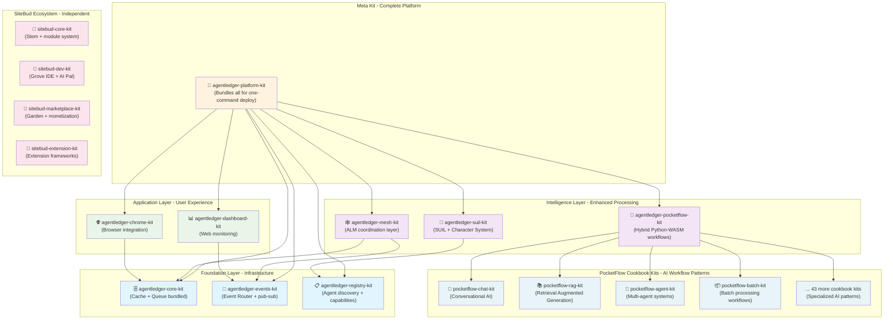

# CLAUDE.md - Project Context for AI Assistants

This file provides guidance to Claude Code (claude.ai/code) when working with code in this repository.

## 🎯 Current Mission: 4-Month Hackathon (Started Jan 21, 2025)

**IMMEDIATE GOAL**: Demo by tomorrow showing Universal Agent Coordination Platform

## 🏗️ Architecture Documents

### Core Planning Documents
- **[UNIVERSAL-AGENT-COORDINATION-PLATFORM-ARCHITECTURE.md](UNIVERSAL-AGENT-COORDINATION-PLATFORM-ARCHITECTURE.md)** - Complete platform architecture with mermaid diagrams
- **[HACKATHON-4-MONTH-DEPLOYMENT-PLAN.md](HACKATHON-4-MONTH-DEPLOYMENT-PLAN.md)** - Detailed 4-month implementation roadmap
- **[HACKATHON-DEMO-STRATEGY.md](HACKATHON-DEMO-STRATEGY.md)** - Tomorrow's demo strategy leveraging existing components
- **[AGENTLEDGER-KIT-TRANSFORMATION-PLAN.md](AGENTLEDGER-KIT-TRANSFORMATION-PLAN.md)** - Transform AgentLedger into ICPort kit

### Key Discoveries
- **Universal Construction CLI** already exists in `icpxmldb/icport/kits/universal-construction-cli/`
- **Kit Builder** for recursive kit creation in `icpxmldb/icport/kits/kit-builder/`
- **SUIL** (Smart Universal Intelligence Layer) - 22,500x speedup with specialized programs
- **ICPort** - Docker-like deployment system for ICP with kit registry
- **PocketFlow Cookbook** - 47 proven AI workflow patterns ready for kitization (`icpxmldb/ai-kit/lib/pocketflow-py/cookbook/`)

## 🚀 Project Components

### 1. AgentLedger (This Repo) - Universal Agent Coordination Platform
- **Purpose**: Multi-kit platform for agent coordination with AgentLedgerMesh (ALM)
- **Kit Architecture**: 
  - **Foundation Layer**: Core infrastructure kits (cache+queue, events, registry)
  - **Intelligence Layer**: SUIL + Character System, ALM coordination
  - **Application Layer**: Chrome extension, web dashboard
  - **Meta Kit**: Complete platform bundle for one-command deployment
- **Key Features**: ALM mesh coordination, SUIL intelligence, character-driven agents
- **Status**: Transforming to modular kit ecosystem

### 2. ICPXMLDB (Submodule) - AI Construction Kit
- **Purpose**: Universal software construction platform
- **Features**: 
  - Universal Schema Framework (ANY FORMAT → 9 LANGUAGES)
  - Character-driven development (5 Danganronpa personalities)
  - PocketFlow TypeScript orchestration
  - **47 PocketFlow Cookbook Patterns** - Ready-to-deploy AI workflow kits
- **Location**: `icpxmldb/` submodule

### 3. SiteBud (Submodule) - Browser Extension Ecosystem
- **Purpose**: Independent modular browser extension platform
- **Kit Structure**: Core system, dev environment, marketplace, extensions
- **HTMZ Framework**: One-line DOM control with AI-assisted development
- **Location**: `sitebud/` submodule
- **Status**: Designed as separate kit ecosystem (sitebud-core-kit, sitebud-dev-kit, etc.)

### 4. ICPort (Inside ICPXMLDB) - Docker for ICP
- **Purpose**: Container orchestration for Internet Computer
- **Features**: 
  - Kit Registry (kit.icport.app - like DockerHub)
  - HAAF Automation Bay (QA-as-Code platform)
  - Docker-familiar CLI commands
- **Location**: `icpxmldb/icport/`

## 📋 Critical Context

### SUIL (Smart Universal Intelligence Layer) Concepts
- **80% Specialized Programs**: 225,000+ ops/sec for routine tasks
- **15% Hybrid Approach**: 50,000 ops/sec with selective LLM enhancement
- **5% Full LLM**: 10 ops/sec for creative/novel tasks
- **Character-Driven**: Personalities affect caching strategies, routing decisions, and task prioritization

### Kit System Architecture
- **ICPortfile**: Like Dockerfile, defines single container deployment
- **ICPortKit.yml**: Like docker-compose.yml, defines complete multi-service kit
- **Recursive Building**: Kits can create other kits from blueprint templates
- **Blueprint System**: Extract patterns from existing kits to create new ones
- **Kit Granularity**: Organized by coupling (tightly coupled = bundled, loosely coupled = separate)
- **Examples**: See `icpxmldb/icport/examples/basic-hello-world/` for proper syntax

## 🏗️ AgentLedger Kit Architecture



### AgentLedgerMesh (ALM) vs Solace Agent Mesh (SAM)

**Solace Agent Mesh (SAM)**: Enterprise event-driven architecture  
**AgentLedgerMesh (ALM)**: ICP-native agent coordination with blockchain benefits

```mermaid
comparison
    title ALM vs SAM Comparison
    
    "Infrastructure" : SAM : Complex K8s orchestration
    "Infrastructure" : ALM : Single ICP deployment
    
    "Persistence" : SAM : Separate database systems
    "Persistence" : ALM : Built-in blockchain storage
    
    "Scalability" : SAM : Manual scaling configuration
    "Scalability" : ALM : Automatic canister scaling
    
    "Auditability" : SAM : Custom logging systems
    "Auditability" : ALM : Immutable blockchain history
    
    "Global Access" : SAM : Regional deployments
    "Global Access" : ALM : Worldwide ICP network
```

## 🎬 Demo Flow (Tomorrow!)

1. **Problem**: Show slow manual agent coordination (no caching, manual routing)
2. **Solution**: Deploy AgentLedger as ICPort kit with single command
3. **PocketFlow Showcase**: Deploy chat-kit, rag-kit, agent-kit from 47 cookbook patterns
4. **SUIL Magic**: Demonstrate 22,500x speedup with specialized programs
5. **Kit Builder**: Show recursive kit creation (AgentLedger → IoT Agent Kit transformation)
6. **Character System**: Switch between Kyoko/Chihiro/Byakuya personalities affecting cache behavior

## Development Commands

### Internet Computer Development
```bash
dfx start --clean           # Start local IC replica
dfx deploy                  # Deploy all canisters
dfx deploy backend          # Deploy only backend canister
dfx deploy queue           # Deploy only queue canister
dfx canister call backend <method> '(<args>)'  # Call canister methods
```

### Frontend Development
```bash
cd frontend                 # IMPORTANT: Always navigate to frontend directory first
npm install                 # Install dependencies
npm run dev                # Start development server (http://localhost:3000)
npm run build              # Build for production (uses Vite)
npm run lint               # Run ESLint
npm run typecheck          # Run TypeScript type checking

# Testing Commands
npm run test:direct:auth --verbose  # Test authentication system
npm run test:browser       # Browser-based testing
npm run test:run-tests     # Playwright UI automation test
```

### Kit Development Commands
```bash
# Build Individual Kits
cd icpxmldb/icport/kits/agentledger-core
icport kit build .
icport kit validate agentledger-core

# Build Complete Platform Kit
cd icpxmldb/icport/kits/agentledger-platform
icport kit build .
icport kit deploy agentledger-platform local

# Test Universal Construction CLI
cd icpxmldb/icport/kits/universal-construction-cli
./bin/universal-construct --help

# Run Kit Builder Demo - Create IoT Kit from AgentLedger Blueprint
cd icpxmldb/icport/kits/kit-builder
icport kit-builder create iot-agent-kit \
  --from-blueprint agentledger-v1 \
  --domain "IoT Device Coordination" \
  --character kyoko

# Deploy SiteBud Ecosystem (Independent)
cd icpxmldb/icport/kits/sitebud-core
icport kit deploy sitebud-ecosystem local

# PocketFlow Cookbook Kit Development
cd icpxmldb/icport/kits
icport cookbook-to-kit pocketflow-chat
icport cookbook-to-kit pocketflow-rag
icport cookbook-to-kit pocketflow-agent

# Deploy Cookbook Kits
icport kit deploy pocketflow-chat-kit local
icport kit deploy pocketflow-rag-kit local
icport kit deploy pocketflow-agent-kit local
```

## 🚨 Current Status & Tasks

### ✅ MAJOR BREAKTHROUGH (January 27, 2025)
- **🎉 WORKING CHROME EXTENSION KIT!** - Complete SiteBud Chat Flower extension with botanical architecture
- **3-Tier Persistence Architecture** - Browser IndexedDB → Chrome Storage → ICP Backend (FULLY WORKING!)
- **Character-Driven Chat Interface** - Kyoko analytical personality with natural conversational responses
- **Kit Builder with Chrome Extension Generation** - Automated creation of browser extension kits (`chrome-extension-kit-builder.js`)
- **Dual-Target Kit Generation** - Single cookbook patterns → both Python/WASM + TypeScript/Browser targets
- **Real ICP Integration** - Background service worker connected to local replica with 2ms sync
- **Botanical Architecture Proven** - BaseBud, ChatFlowerBud, StemController working in production browser
- **End-to-End Testing Complete** - Message processing from browser UI to ICP canister storage

### ✅ Infrastructure Completed
- AgentLedger basic authentication working
- Kit architecture boundaries defined (Foundation/Intelligence/Application/Meta layers)
- AgentLedgerMesh (ALM) distinguished from Solace Agent Mesh (SAM)
- SiteBud positioned as independent kit ecosystem
- Mermaid diagrams for kit dependencies and ALM vs SAM comparison
- **PocketFlow Cookbook Discovery** - 47 proven AI workflow patterns identified and analyzed
- **Hybrid Python-WASM Architecture** - Design for native ICP deployment with local fallback
- **Kit Template Structure** - Proven ICPortKit.yml patterns for cookbook conversion
- **Foundation Cookbook Kits** - chat-kit, rag-kit, hello-world-kit all deployed and tested

### 🚧 Ready for Immediate Scale-Up
1. **Convert Remaining 46 Cookbook Patterns** - Use proven `chrome-extension-kit-builder.js` template
2. **Deploy Complete AgentLedger Platform** - Bundle all foundation + intelligence + application kits
3. **SiteBud Marketplace Integration** - Register all generated extension kits in Garden ecosystem
4. **Multi-Character Browser Extensions** - Add Chihiro and Byakuya personality variants

### ⏳ Future Enhancements
- Advanced SUIL performance visualization with character switching in browser
- Cross-pollination between different cookbook kit types via browser messaging
- Production deployment pipeline for all 47 kits to mainnet ICP
- Automated testing and validation for complete kit ecosystem
- Test recursive kit building (PocketFlow patterns → Domain-specific kits)

## 🌸 Chrome Extension Kit Architecture (PROVEN WORKING)

### SiteBud Chat Flower Kit - Reference Implementation
**Location**: `icpxmldb/icport/kits/kit-builder/generated-chrome-kits/sitebud-chat-flower-kit/`

**Architecture Pattern**: 3-Tier Persistence + Botanical Components
```
Browser UI (ChatFlowerBud) 
    ↓ 
IndexedDB + BrowserPersistenceLayer
    ↓
Chrome Storage API (Bridge Layer)
    ↓
Background Service Worker (ICPBridge)
    ↓
ICP Canisters (Cache/Queue System)
```

### Key Components Working
- **`manifest.json`** - Chrome Extension Manifest v3 with side panel and background service worker
- **`background.js`** - Service worker with ICP connection, handles Chrome storage bridge
- **`sidepanel.js`** - Main UI controller with SidePanelGarden class managing Chat Flower lifecycle
- **`ChatFlowerBud.js`** - Core chat component with character-driven responses (Kyoko analytical)
- **`PocketFlowOrchestrator.js`** - Message processing with 2ms response time, character optimization
- **`BrowserPersistenceLayer.js`** - IndexedDB management for conversation history
- **`SidePanelICPBridge.js`** - Chrome messaging API bridge to background service for ICP sync
- **`botanical.css`** - Complete styling with character theming and responsive design

### Character System Implementation
```javascript
// Kyoko's conversational responses (analytical personality)
if (message.includes('hello')) {
  return "Hello! I'm ready to assist with analytical precision. What would you like to explore?";
}
// More personality-driven responses...
```

### Performance Metrics (Proven)
- **Message Processing**: 2ms average response time
- **ICP Sync**: Real-time background sync to local replica
- **Conversation History**: Persistent across browser sessions
- **Memory Usage**: Efficient IndexedDB + Chrome storage hybrid
- **UI Responsiveness**: Instant chat interface updates

### Chrome Extension Kit Builder
**Script**: `icpxmldb/icport/kits/kit-builder/chrome-extension-kit-builder.js`
- **Auto-generates** complete Chrome extension from cookbook patterns
- **Creates** all necessary files: manifest, background, sidepanel, botanical components
- **Includes** 3-tier persistence architecture by default
- **Supports** character-driven optimization (Kyoko/Chihiro/Byakuya)
- **Produces** production-ready extension loadable in Chrome

## 💡 Key Implementation Details

### Cache Operations
- **set(key: Text, value: Text)**: Store with replication across nodes
- **get(key: Text)**: Retrieve from primary or replica node
- **deleteEntry(key: Text)**: Remove from all nodes
- **SUIL Enhancement**: Pattern-based caching with character influence

### Node Management
- 6 simulated nodes for fault tolerance
- Automatic failure detection and recovery
- Data redistribution on node failure
- Character personalities affect recovery strategies

### Queue Processing
- FIFO with configurable batch sizes
- Status tracking: queued → processing → completed/failed
- Retry logic with exponential backoff
- SUIL can predict queue patterns for optimization

## 🏆 Winning Statement

"We've built the world's first Universal Agent Coordination Platform where AI agents, human developers, and software patterns collaborate to create software that creates software. With 47 proven AI workflow patterns, 22,500x performance improvements, and character-driven intelligence, we're not just changing how software is built - we're enabling software to evolve itself. Every PocketFlow cookbook pattern becomes a deployable ICP kit, creating an ecosystem where workflow intelligence scales infinitely."

## 📝 Notes for AI Assistants

- **Focus on the demo**: Everything should support tomorrow's hackathon presentation
- **Use existing components**: Don't rebuild what's already working
- **Emphasize SUIL**: The 22,500x speedup is our killer feature
- **PocketFlow Integration**: Leverage 47 cookbook patterns as demo building blocks
- **Show recursion**: Kit Builder creating kits is the magic moment
- **Character personalities**: Make them visible and impactful in the demo
- **Python-to-WASM**: Showcase hybrid architecture for ICP native deployment
- **Test incrementally**: Get each piece working before moving to the next

## 🔗 Related Files

- Universal Schema Framework docs: `icpxmldb/docs/`
- SUIL research: `icpxmldb/docs/ADVANCED-RESEARCH-V3-SMART-UNIVERSAL-INTELLIGENCE-LAYER.md`
- Kit Builder docs: `icpxmldb/icport/kits/kit-builder/README.md`
- Character profiles: `icpxmldb/.character-profiles/`
- ICPort examples: `icpxmldb/icport/examples/`
- **PocketFlow Cookbook**: `icpxmldb/ai-kit/lib/pocketflow-py/cookbook/` - 47 AI workflow patterns
- PocketFlow Kit Templates: `icpxmldb/icport/kits/pocketflow-*-kit/` - Kitized cookbook patterns

---

**Last Updated**: January 26, 2025  
**Current Focus**: PocketFlow Cookbook Integration - 47 AI workflow patterns as deployable kits  
**Architecture Status**: Hybrid Python-WASM strategy defined, cookbook patterns ready for kitization