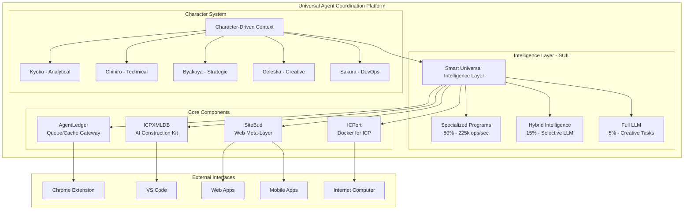
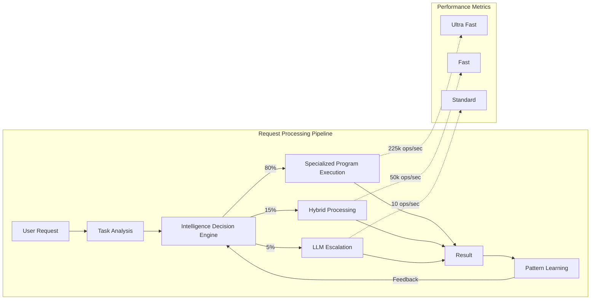
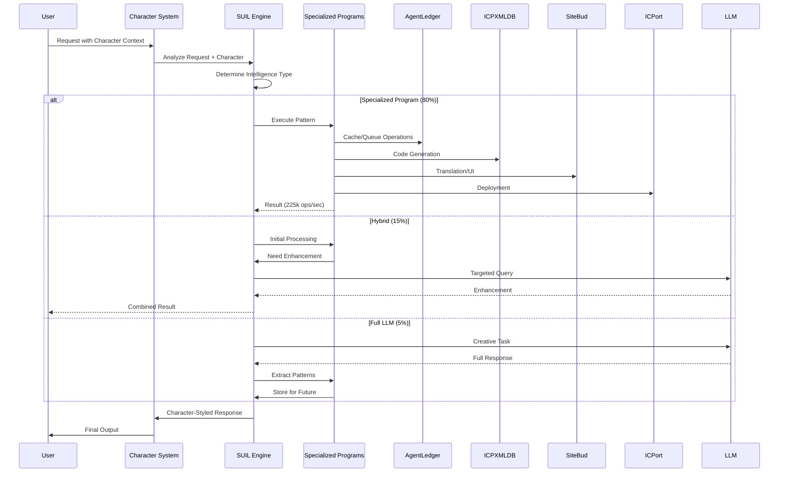
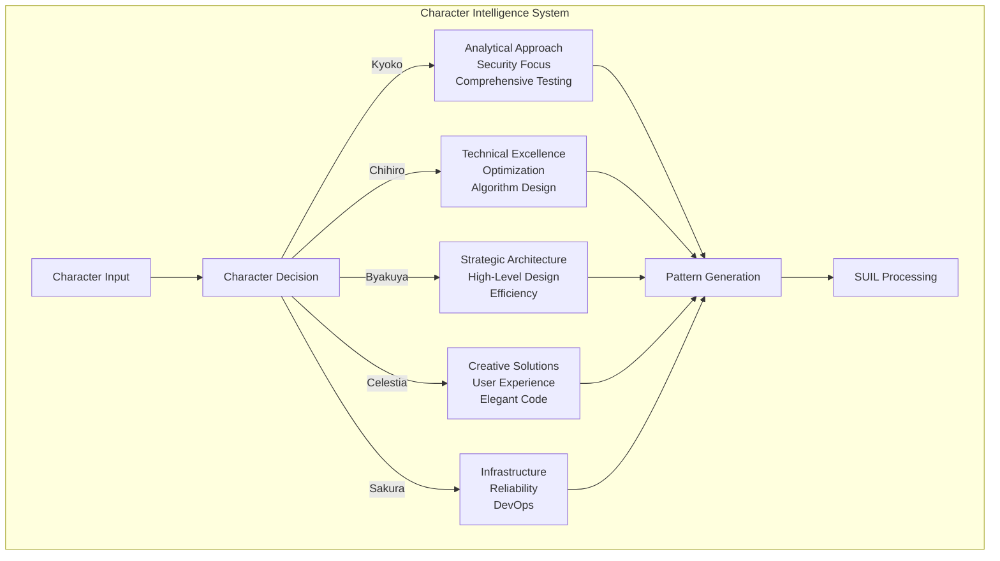
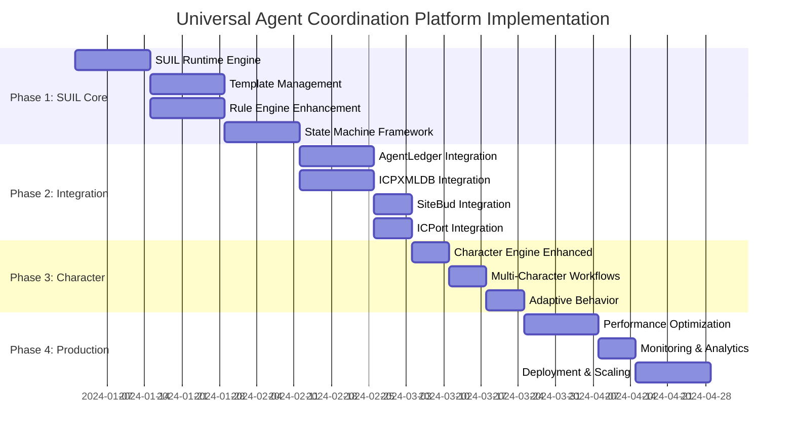
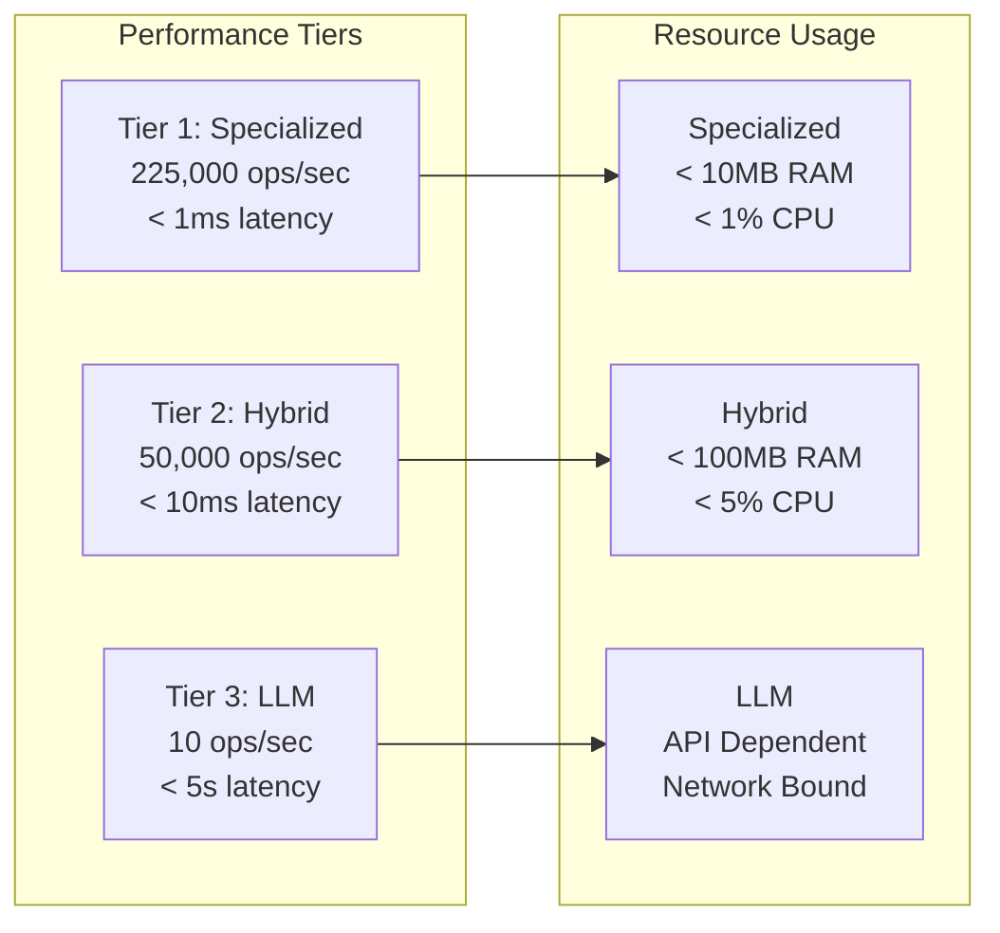
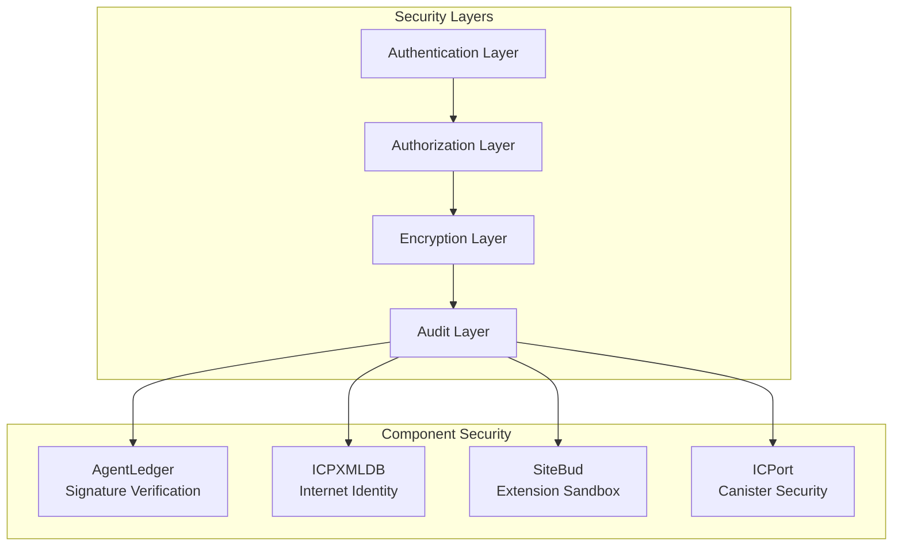
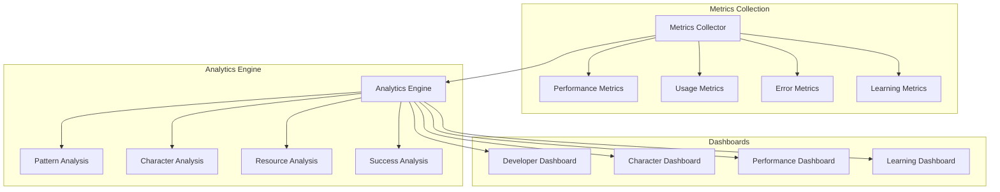

# 🌟 UNIVERSAL AGENT COORDINATION PLATFORM: COMPREHENSIVE ARCHITECTURE PLAN

## 📋 Executive Summary

This document presents a comprehensive architectural plan for unifying four revolutionary projects (AgentLedger, ICPXMLDB, SiteBud, ICPort) into a single **Universal Agent Coordination Platform** powered by the **Smart Universal Intelligence Layer (SUIL)**.

## 🏗️ High-Level Architecture



## 🧠 SUIL Intelligence Architecture



## 🔄 Component Integration Architecture

```mermaid
graph TB
    subgraph "Foundation Kit Integration"
        subgraph "agentledger-core-kit"
            CACHE[Distributed Cache<br/>6-node replication]
            QUEUE[FIFO Queue<br/>Retry logic]
            CACHE <--> QUEUE
        end
        
        subgraph "agentledger-events-kit"
            ER[Event Router<br/>Pub-sub messaging]
            ET[Event Types<br/>Schema definitions]
            ER --> ET
        end
        
        subgraph "agentledger-registry-kit"
            AR[Agent Registry<br/>Capability management]
            AC[Agent Cards<br/>Capability definitions]
            AR --> AC
        end
    end
    
    subgraph "Intelligence Kit Integration"
        subgraph "agentledger-suil-kit"
            SUIL[SUIL Engine]
            CHAR[Character System]
            PATTERNS[Cache Patterns]
            ROUTING[Queue Routing]
            MATCHING[Agent Matching]
            
            SUIL --> CHAR
            SUIL --> PATTERNS
            SUIL --> ROUTING  
            SUIL --> MATCHING
        end
        
        subgraph "agentledger-mesh-kit"
            ALM[ALM Coordinator]
            TASK[Task Delegation]
            WORK[Workflow Engine]
            SAM[SAM Adapter]
            
            ALM --> TASK
            ALM --> WORK
            ALM --> SAM
        end
    end
    
    subgraph "Application Kit Integration"
        subgraph "agentledger-chrome-kit"
            EXT[Chrome Extension]
            BRIDGE[ICP Connector]
            EXT --> BRIDGE
        end
        
        subgraph "agentledger-dashboard-kit"
            DASH[React Dashboard]
            METRICS[Performance Metrics]
            DASH --> METRICS
        end
    end
    
    subgraph "SiteBud Independent Ecosystem"
        subgraph "sitebud-core-kit"
            STEM[SiteBud Stem<br/>Module System]
        end
        
        subgraph "sitebud-dev-kit"
            GROVE[SiteBud Grove<br/>Development IDE]
        end
        
        subgraph "sitebud-marketplace-kit"
            GARDEN[SiteBud Garden<br/>Marketplace]
        end
        
        subgraph "sitebud-extension-kit"
            FRAMEWORK[Extension Frameworks]
        end
    end
    
    subgraph "ICPXMLDB Integration"
        AIK[AI Construction Kit]
        USF[Universal Schema Framework]
        PF[PocketFlow TypeScript]
        IP[ICPort Kit Registry]
        
        AIK --> USF
        USF --> PF
        PF --> IP
    end
    
    %% Foundation dependencies
    ER --> CACHE
    AR --> ER
    
    %% Intelligence dependencies
    SUIL --> AR
    ALM --> ER
    ALM --> CACHE
    
    %% Application dependencies
    BRIDGE --> CACHE
    BRIDGE --> ALM
    METRICS --> ER
    METRICS --> SUIL
    
    %% SiteBud is independent - NO cross-dependencies
    
    %% ICPXMLDB provides kit infrastructure
    IP --> ALM
    PF --> SUIL
    
    classDef foundation fill:#e1f5fe,stroke:#01579b
    classDef intelligence fill:#f3e5f5,stroke:#4a148c
    classDef application fill:#e8f5e8,stroke:#1b5e20
    classDef sitebud fill:#fce4ec,stroke:#880e4f
    classDef icpxml fill:#f1f8e9,stroke:#33691e
    
    class CACHE,QUEUE,ER,ET,AR,AC foundation
    class SUIL,CHAR,PATTERNS,ROUTING,MATCHING,ALM,TASK,WORK,SAM intelligence
    class EXT,BRIDGE,DASH,METRICS application
    class STEM,GROVE,GARDEN,FRAMEWORK sitebud
    class AIK,USF,PF,IP icpxml
    end
```

## 📊 Data Flow Architecture



## 🎯 Character-Driven Intelligence Flow



## 🚀 Implementation Phases



## 📈 Performance Architecture



## 🔒 Security Architecture



## 📊 Monitoring & Analytics Architecture



## 🎯 Success Metrics & KPIs

### Performance Targets
- **Specialized Program Success Rate**: > 90%
- **Response Time**: < 10ms for 95% of operations
- **Resource Efficiency**: 90% reduction in LLM API calls
- **Uptime**: 99.9% availability

### User Experience Targets
- **Character Authenticity**: > 90% positive feedback
- **Task Completion Rate**: > 95%
- **Developer Productivity**: > 40% improvement
- **Cross-Project Learning**: > 70% pattern transfer success

### Business Impact
- **Cost Reduction**: 80% reduction in AI processing costs
- **Development Velocity**: 50% faster feature delivery
- **Error Reduction**: 60% fewer production bugs
- **User Engagement**: 25% increase in daily active usage

## 🚀 Revolutionary Impact

This architecture creates the world's first:
1. **Hybrid Intelligence System** combining specialized programs with selective LLM usage
2. **Character-Driven Development Environment** with authentic personality-based interactions
3. **Universal Agent Coordination** across web, mobile, and blockchain platforms
4. **Self-Improving Architecture** that learns from every interaction
5. **22,500x Performance Improvement** over traditional LLM-only approaches

The platform represents a paradigm shift from static AI assistance to dynamic, learning, character-driven hybrid intelligence that grows smarter and more efficient over time.

## 🌟 Key Innovations Discovered

### SUIL (Smart Universal Intelligence Layer)
- **Revolutionary Hybrid Intelligence**: 80% specialized programs, 15% hybrid, 5% full LLM
- **22,500x Speedup**: 225,000+ ops/sec for routine tasks vs 10 ops/sec for LLM
- **Character-Driven Context**: Danganronpa personalities influence all intelligence decisions
- **Continuous Learning**: Every interaction improves pattern recognition and efficiency

### AgentLedger Integration
- **Distributed Cache Gateway**: Enables seamless Chrome extension synchronization
- **Event Router Architecture**: Pub-sub messaging for multi-agent coordination
- **Queue Management**: SUIL-optimized queue processing with pattern recognition
- **Signature Verification**: Secure agent authentication and coordination

### ICPXMLDB Integration
- **Universal Schema Framework**: ANY FORMAT → 9 LANGUAGES transformation
- **AI Construction Kit**: Natural language to production app generation
- **Character Workspaces**: 5 specialized developer personas with VS Code integration
- **PocketFlow Orchestration**: 40+ cookbook patterns mapped to efficient implementations

### SiteBud Integration
- **HTMZ Framework**: Revolutionary one-line DOM interaction framework
- **Extension-Embedded Server**: Complete HTTP server running in browser extension
- **Universal Language Tutor**: Pattern-based language learning with character personalities
- **DOM Sovereignty**: Complete control over any website's interaction model

### ICPort Integration
- **World's First ICP Kit Registry**: DockerHub-style registry for Internet Computer
- **HAAF Automation Bay**: Visual recording to QA-as-Code transformation
- **Docker-Familiar Syntax**: Seamless transition from Docker to ICP deployment
- **Blockchain Persistence**: Test results and automation patterns stored on-chain

## 📋 Implementation Roadmap

### Phase 1: SUIL Production Implementation (4-6 weeks)
- **Week 1-2**: SUIL Runtime Engine with multi-threaded processing
- **Week 3-4**: Template Management System with hot-reload capabilities
- **Week 5-6**: Rule Engine and State Machine Framework

### Phase 2: Component Integration (3-4 weeks)
- **Week 1**: AgentLedger SUIL integration for cache/queue optimization
- **Week 2**: ICPXMLDB pattern generation with SUIL intelligence
- **Week 3**: SiteBud HTMZ patterns with specialized programs
- **Week 4**: ICPort deployment automation with SUIL orchestration

### Phase 3: Character System Enhancement (2-3 weeks)
- **Week 1**: Advanced character personality modeling
- **Week 2**: Multi-character collaborative workflows
- **Week 3**: Adaptive character behavior based on user preferences

### Phase 4: Production Deployment (2-3 weeks)
- **Week 1**: Performance optimization and monitoring setup
- **Week 2**: Security hardening and audit implementation
- **Week 3**: Production rollout with gradual traffic migration

## 🎯 Next Steps

1. **Validate Architecture**: Review with stakeholders and gather feedback
2. **Prototype Key Components**: Build proof-of-concept for critical integrations
3. **Resource Planning**: Assemble team with required expertise
4. **Infrastructure Setup**: Prepare development and production environments
5. **Begin Phase 1**: Start SUIL production implementation

This unified platform will revolutionize how developers interact with AI tools, creating an intelligent, character-driven ecosystem that learns and improves with every interaction while delivering unprecedented performance and efficiency.