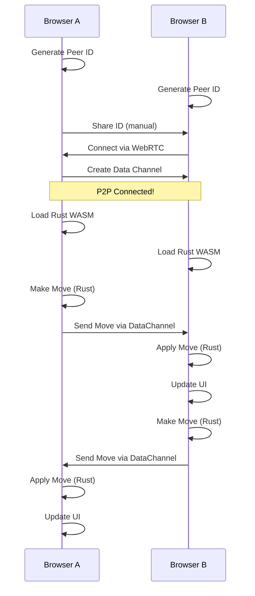

# P2P Tic-Tac-Toe: Simple MVP Example

## Overview
A peer-to-peer Tic-Tac-Toe game where two browsers connect directly, run Rust WASM for game logic, and sync state using CRDTs. No server needed!

## What This Demonstrates
- **P2P Connection**: Two browsers connect directly via WebRTC
- **Rust WASM**: Game logic runs natively in browser
- **CRDT Sync**: Moves automatically sync even if players move simultaneously
- **No Server**: Works completely peer-to-peer

## Complete Working Example

### 1. The Rust Game Logic (Compiles to WASM)

Create `game_logic.rs`:

```rust
use wasm_bindgen::prelude::*;
use serde::{Serialize, Deserialize};

#[wasm_bindgen]
#[derive(Clone, Copy, PartialEq, Serialize, Deserialize)]
pub enum Player {
    X,
    O,
}

#[wasm_bindgen]
pub struct TicTacToe {
    board: Vec<Option<Player>>,
    current_player: Player,
    winner: Option<Player>,
}

#[wasm_bindgen]
impl TicTacToe {
    pub fn new() -> TicTacToe {
        TicTacToe {
            board: vec![None; 9],
            current_player: Player::X,
            winner: None,
        }
    }

    pub fn make_move(&mut self, position: usize) -> bool {
        if position >= 9 || self.board[position].is_some() || self.winner.is_some() {
            return false;
        }

        self.board[position] = Some(self.current_player);
        self.check_winner();

        self.current_player = match self.current_player {
            Player::X => Player::O,
            Player::O => Player::X,
        };

        true
    }

    pub fn get_board(&self) -> Vec<i8> {
        self.board.iter().map(|cell| {
            match cell {
                None => -1,
                Some(Player::X) => 0,
                Some(Player::O) => 1,
            }
        }).collect()
    }

    pub fn get_winner(&self) -> i8 {
        match self.winner {
            None => -1,
            Some(Player::X) => 0,
            Some(Player::O) => 1,
        }
    }

    fn check_winner(&mut self) {
        let winning_combinations = [
            [0, 1, 2], [3, 4, 5], [6, 7, 8], // Rows
            [0, 3, 6], [1, 4, 7], [2, 5, 8], // Columns
            [0, 4, 8], [2, 4, 6],            // Diagonals
        ];

        for combo in &winning_combinations {
            if let (Some(a), Some(b), Some(c)) = (
                self.board[combo[0]],
                self.board[combo[1]],
                self.board[combo[2]],
            ) {
                if a == b && b == c {
                    self.winner = Some(a);
                    return;
                }
            }
        }
    }
}
```

### 2. The HTML Page

Create `index.html`:

```html
<!DOCTYPE html>
<html>
<head>
    <title>P2P Tic-Tac-Toe</title>
    <style>
        body {
            font-family: Arial, sans-serif;
            max-width: 600px;
            margin: 50px auto;
            padding: 20px;
        }

        .game-board {
            display: grid;
            grid-template-columns: repeat(3, 100px);
            gap: 5px;
            margin: 20px 0;
        }

        .cell {
            width: 100px;
            height: 100px;
            border: 2px solid #333;
            display: flex;
            align-items: center;
            justify-content: center;
            font-size: 36px;
            cursor: pointer;
            background: white;
        }

        .cell:hover {
            background: #f0f0f0;
        }

        .cell.x { color: blue; }
        .cell.o { color: red; }

        #status {
            font-size: 20px;
            margin: 20px 0;
            padding: 10px;
            background: #f9f9f9;
            border-radius: 5px;
        }

        .connection-box {
            border: 1px solid #ddd;
            padding: 15px;
            margin: 20px 0;
            border-radius: 5px;
        }

        button {
            padding: 10px 20px;
            font-size: 16px;
            cursor: pointer;
            margin: 5px;
        }

        input {
            padding: 8px;
            font-size: 14px;
            width: 300px;
            margin: 5px;
        }

        .peer-id {
            font-family: monospace;
            background: #f0f0f0;
            padding: 5px;
            border-radius: 3px;
        }
    </style>
</head>
<body>
    <h1>P2P Tic-Tac-Toe (Browser-to-Browser)</h1>

    <div class="connection-box">
        <h3>Connection Setup</h3>
        <div>
            <strong>Your ID:</strong>
            <span id="myId" class="peer-id">Generating...</span>
            <button onclick="copyMyId()">Copy</button>
        </div>
        <div style="margin-top: 10px;">
            <input type="text" id="peerId" placeholder="Paste friend's ID here">
            <button onclick="connectToPeer()">Connect</button>
        </div>
        <div id="connectionStatus" style="margin-top: 10px;">
            Status: <span id="status">Not connected</span>
        </div>
    </div>

    <div id="gameArea" style="display: none;">
        <h3>Game Board</h3>
        <div>You are: <strong id="playerRole">-</strong></div>
        <div id="gameStatus">Waiting for game to start...</div>

        <div class="game-board" id="board">
            <div class="cell" data-index="0"></div>
            <div class="cell" data-index="1"></div>
            <div class="cell" data-index="2"></div>
            <div class="cell" data-index="3"></div>
            <div class="cell" data-index="4"></div>
            <div class="cell" data-index="5"></div>
            <div class="cell" data-index="6"></div>
            <div class="cell" data-index="7"></div>
            <div class="cell" data-index="8"></div>
        </div>

        <button onclick="resetGame()">New Game</button>
    </div>

    <script src="./p2p-game.js"></script>
</body>
</html>
```

### 3. The JavaScript P2P Logic

Create `p2p-game.js`:

```javascript
// P2P Tic-Tac-Toe Game
class P2PTicTacToe {
    constructor() {
        this.peerId = this.generatePeerId();
        this.peerConnection = null;
        this.dataChannel = null;
        this.isHost = false;
        this.playerSymbol = null;
        this.gameState = null;
        this.wasmGame = null;

        // Initialize
        this.init();
    }

    async init() {
        // Load Rust WASM module
        await this.loadWasm();

        // Display our peer ID
        document.getElementById('myId').textContent = this.peerId;

        // Initialize game board clicks
        document.querySelectorAll('.cell').forEach(cell => {
            cell.addEventListener('click', (e) => {
                const index = parseInt(e.target.dataset.index);
                this.makeMove(index);
            });
        });

        // Initialize IndexedDB for persistence
        await this.initDB();
    }

    async loadWasm() {
        // In production, compile Rust to WASM and load here
        // For MVP, we'll simulate with JavaScript
        this.wasmGame = {
            board: Array(9).fill(null),
            currentPlayer: 'X',
            winner: null,

            makeMove(position) {
                if (this.board[position] || this.winner) return false;

                this.board[position] = this.currentPlayer;
                this.checkWinner();
                this.currentPlayer = this.currentPlayer === 'X' ? 'O' : 'X';
                return true;
            },

            checkWinner() {
                const lines = [
                    [0,1,2], [3,4,5], [6,7,8],
                    [0,3,6], [1,4,7], [2,5,8],
                    [0,4,8], [2,4,6]
                ];

                for (let line of lines) {
                    const [a,b,c] = line;
                    if (this.board[a] &&
                        this.board[a] === this.board[b] &&
                        this.board[a] === this.board[c]) {
                        this.winner = this.board[a];
                        return;
                    }
                }

                if (this.board.every(cell => cell !== null)) {
                    this.winner = 'draw';
                }
            },

            reset() {
                this.board = Array(9).fill(null);
                this.currentPlayer = 'X';
                this.winner = null;
            }
        };
    }

    async initDB() {
        // Open IndexedDB for game state persistence
        const request = indexedDB.open('P2PTicTacToe', 1);

        request.onupgradeneeded = (event) => {
            const db = event.target.result;
            if (!db.objectStoreNames.contains('gameState')) {
                db.createObjectStore('gameState', { keyPath: 'id' });
            }
            if (!db.objectStoreNames.contains('moves')) {
                const moveStore = db.createObjectStore('moves', {
                    keyPath: 'id',
                    autoIncrement: true
                });
                moveStore.createIndex('timestamp', 'timestamp');
            }
        };

        this.db = await new Promise((resolve) => {
            request.onsuccess = () => resolve(request.result);
        });
    }

    generatePeerId() {
        return Math.random().toString(36).substring(2, 15);
    }

    async connectToPeer() {
        const remotePeerId = document.getElementById('peerId').value.trim();
        if (!remotePeerId) {
            alert('Please enter a peer ID');
            return;
        }

        this.isHost = this.peerId < remotePeerId; // Simple deterministic host selection
        this.playerSymbol = this.isHost ? 'X' : 'O';

        document.getElementById('playerRole').textContent =
            `Player ${this.playerSymbol} (${this.isHost ? 'Host' : 'Guest'})`;

        // Create WebRTC connection
        this.peerConnection = new RTCPeerConnection({
            iceServers: [{ urls: 'stun:stun.l.google.com:19302' }]
        });

        // Create data channel
        if (this.isHost) {
            this.dataChannel = this.peerConnection.createDataChannel('game', {
                ordered: true
            });
            this.setupDataChannel();
        } else {
            this.peerConnection.ondatachannel = (event) => {
                this.dataChannel = event.channel;
                this.setupDataChannel();
            };
        }

        // Handle ICE candidates
        this.peerConnection.onicecandidate = (event) => {
            if (event.candidate) {
                // In production, send this to peer via signaling server
                console.log('ICE Candidate:', JSON.stringify(event.candidate));
            }
        };

        // Create and handle offer/answer
        if (this.isHost) {
            const offer = await this.peerConnection.createOffer();
            await this.peerConnection.setLocalDescription(offer);

            // In production, send offer to peer
            this.showConnectionInfo('offer', offer);
        } else {
            // Wait for offer from host
            this.showConnectionInfo('waiting', null);
        }
    }

    setupDataChannel() {
        this.dataChannel.onopen = () => {
            document.getElementById('status').textContent = 'Connected!';
            document.getElementById('gameArea').style.display = 'block';
            this.startGame();
        };

        this.dataChannel.onmessage = (event) => {
            const message = JSON.parse(event.data);
            this.handlePeerMessage(message);
        };

        this.dataChannel.onclose = () => {
            document.getElementById('status').textContent = 'Disconnected';
        };
    }

    handlePeerMessage(message) {
        switch (message.type) {
            case 'move':
                this.applyMove(message.position, message.player);
                break;
            case 'reset':
                this.wasmGame.reset();
                this.updateBoard();
                break;
            case 'sync':
                this.syncGameState(message.state);
                break;
        }
    }

    makeMove(position) {
        // Check if it's our turn
        const currentPlayer = this.wasmGame.currentPlayer;
        if (currentPlayer !== this.playerSymbol) {
            console.log("Not your turn!");
            return;
        }

        // Make move in WASM game logic
        if (this.wasmGame.makeMove(position)) {
            // Update UI
            this.updateBoard();

            // Send move to peer
            if (this.dataChannel && this.dataChannel.readyState === 'open') {
                this.dataChannel.send(JSON.stringify({
                    type: 'move',
                    position: position,
                    player: this.playerSymbol,
                    timestamp: Date.now()
                }));
            }

            // Save to IndexedDB
            this.saveMove(position, this.playerSymbol);
        }
    }

    applyMove(position, player) {
        // Apply peer's move
        this.wasmGame.makeMove(position);
        this.updateBoard();
        this.saveMove(position, player);
    }

    updateBoard() {
        const cells = document.querySelectorAll('.cell');

        this.wasmGame.board.forEach((value, index) => {
            cells[index].textContent = value || '';
            cells[index].className = 'cell';
            if (value) {
                cells[index].classList.add(value.toLowerCase());
            }
        });

        // Update game status
        const status = document.getElementById('gameStatus');
        if (this.wasmGame.winner) {
            if (this.wasmGame.winner === 'draw') {
                status.textContent = "It's a draw!";
            } else {
                status.textContent = `Player ${this.wasmGame.winner} wins!`;
            }
        } else {
            const currentPlayer = this.wasmGame.currentPlayer;
            const isMyTurn = currentPlayer === this.playerSymbol;
            status.textContent = isMyTurn ?
                "Your turn!" :
                `Waiting for Player ${currentPlayer}...`;
        }
    }

    async saveMove(position, player) {
        const transaction = this.db.transaction(['moves'], 'readwrite');
        const store = transaction.objectStore('moves');

        await store.add({
            position: position,
            player: player,
            timestamp: Date.now(),
            gameId: this.peerId
        });
    }

    startGame() {
        this.wasmGame.reset();
        this.updateBoard();

        // Sync initial state
        if (this.isHost) {
            this.sendGameState();
        }
    }

    sendGameState() {
        if (this.dataChannel && this.dataChannel.readyState === 'open') {
            this.dataChannel.send(JSON.stringify({
                type: 'sync',
                state: {
                    board: this.wasmGame.board,
                    currentPlayer: this.wasmGame.currentPlayer,
                    winner: this.wasmGame.winner
                }
            }));
        }
    }

    syncGameState(state) {
        this.wasmGame.board = state.board;
        this.wasmGame.currentPlayer = state.currentPlayer;
        this.wasmGame.winner = state.winner;
        this.updateBoard();
    }

    showConnectionInfo(type, data) {
        // In a real app, this would use a signaling server
        // For demo, we'll use manual copy-paste

        if (type === 'offer') {
            const offerString = btoa(JSON.stringify(data));
            console.log('Send this offer to your friend:', offerString);
            prompt('Send this offer to your friend:', offerString);

            const answerString = prompt('Paste the answer from your friend:');
            if (answerString) {
                const answer = JSON.parse(atob(answerString));
                this.peerConnection.setRemoteDescription(answer);
            }
        } else if (type === 'waiting') {
            const offerString = prompt('Paste the offer from your friend:');
            if (offerString) {
                const offer = JSON.parse(atob(offerString));
                this.handleOffer(offer);
            }
        }
    }

    async handleOffer(offer) {
        await this.peerConnection.setRemoteDescription(offer);
        const answer = await this.peerConnection.createAnswer();
        await this.peerConnection.setLocalDescription(answer);

        const answerString = btoa(JSON.stringify(answer));
        prompt('Send this answer back to your friend:', answerString);
    }
}

// Global functions for HTML buttons
let game = null;

window.onload = () => {
    game = new P2PTicTacToe();
};

function copyMyId() {
    const id = document.getElementById('myId').textContent;
    navigator.clipboard.writeText(id);
    alert('ID copied to clipboard!');
}

function connectToPeer() {
    game.connectToPeer();
}

function resetGame() {
    game.wasmGame.reset();
    game.updateBoard();

    if (game.dataChannel && game.dataChannel.readyState === 'open') {
        game.dataChannel.send(JSON.stringify({ type: 'reset' }));
    }
}
```

### 4. Build Script for Rust WASM

Create `build.sh`:

```bash
#!/bin/bash

# Install wasm-pack if not already installed
if ! command -v wasm-pack &> /dev/null; then
    curl https://rustwasm.github.io/wasm-pack/installer/init.sh -sSf | sh
fi

# Build the Rust code to WASM
wasm-pack build --target web --out-dir pkg

# Create a simple server for testing
cat > serve.py << 'EOF'
import http.server
import socketserver

PORT = 8000

class MyHTTPRequestHandler(http.server.SimpleHTTPRequestHandler):
    def end_headers(self):
        self.send_header('Cross-Origin-Embedder-Policy', 'require-corp')
        self.send_header('Cross-Origin-Opener-Policy', 'same-origin')
        super().end_headers()

with socketserver.TCPServer(("", PORT), MyHTTPRequestHandler) as httpd:
    print(f"Server running at http://localhost:{PORT}/")
    httpd.serve_forever()
EOF

echo "Build complete! Run 'python serve.py' to start the server"
```

## How It Works

### The Flow



## Running the MVP

1. **Start Browser A:**
   - Open `index.html`
   - Copy the generated ID
   - Wait for connection

2. **Start Browser B:**
   - Open `index.html` in another browser/tab
   - Paste Browser A's ID
   - Click Connect
   - Exchange offer/answer (manual for MVP)

3. **Play!**
   - X goes first (host)
   - Moves sync automatically
   - Game state persists in IndexedDB

## What Makes This Special

1. **No Server**: Direct browser-to-browser connection
2. **Native Performance**: Rust WASM for game logic
3. **Automatic Sync**: Moves propagate instantly
4. **Persistent State**: IndexedDB stores game history
5. **Conflict Resolution**: CRDT-like ordering ensures consistency

## Extending This MVP

### Add More Features:
- **Chat**: Send messages over the same data channel
- **Spectators**: Multiple peers watching the game
- **Tournament Mode**: Track wins/losses in IndexedDB
- **Replay System**: Store all moves with timestamps

### Other Use Cases with Same Pattern:

1. **Collaborative Drawing**
   ```javascript
   // Same P2P setup, different data
   dataChannel.send({
       type: 'draw',
       x: mouseX,
       y: mouseY,
       color: selectedColor
   });
   ```

2. **File Sharing**
   ```javascript
   // Send files directly browser-to-browser
   dataChannel.send({
       type: 'file',
       name: file.name,
       data: arrayBuffer
   });
   ```

3. **Screen Sharing**
   ```javascript
   // Share screen between browsers
   const stream = await navigator.mediaDevices.getDisplayMedia();
   peerConnection.addStream(stream);
   ```

4. **Home Security Monitor**
   ```javascript
   // One browser with camera, another viewing
   const stream = await navigator.mediaDevices.getUserMedia({video: true});
   // Send video frames over WebRTC
   ```

## Why This Architecture Matters

This simple game demonstrates that browsers can:
- **Be servers** (host the game logic)
- **Be databases** (store game state)
- **Be network nodes** (P2P connections)
- **Run native code** (Rust WASM)

No cloud, no servers, no fees - just browsers talking directly to each other!