# YDN-DB and CRDT Deep Dive for Browser-as-Server Architecture

## Table of Contents
1. [YDN-DB Architecture and Operations](#ydn-db-architecture-and-operations)
2. [CRDT Fundamentals and Types](#crdt-fundamentals-and-types)
3. [Integration Patterns](#integration-patterns)
4. [Conflict Resolution Strategies](#conflict-resolution-strategies)
5. [Synchronization Protocols](#synchronization-protocols)
6. [Implementation Examples](#implementation-examples)

## YDN-DB Architecture and Operations

### Overview
YDN-DB is a database library for browser-based storage that provides IndexedDB abstraction with advanced features like entity synchronization, query optimization, and conflict resolution.

### Core Architecture

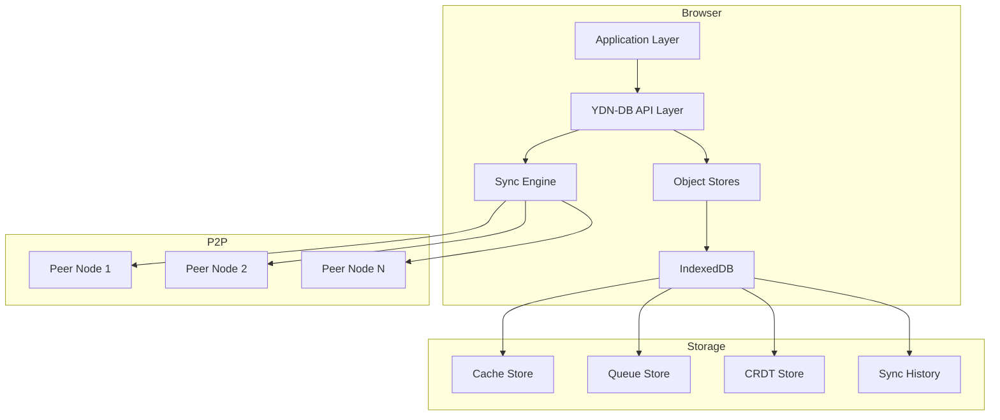

### YDN-DB Schema Definition

```javascript
const databaseSchema = {
  name: 'browser-server-db',
  version: 1,
  stores: [
    {
      name: 'cache',
      keyPath: 'key',
      type: 'TEXT',
      indexes: [
        {
          name: 'by_node',
          keyPath: 'nodeId',
          unique: false,
          multiEntry: false
        },
        {
          name: 'by_timestamp',
          keyPath: 'timestamp',
          unique: false
        },
        {
          name: 'by_etag',
          keyPath: 'etag',
          unique: false
        }
      ]
    },
    {
      name: 'crdt_state',
      keyPath: 'docId',
      indexes: [
        {
          name: 'by_type',
          keyPath: 'crdtType'
        },
        {
          name: 'by_vector_clock',
          keyPath: 'vectorClock',
          multiEntry: true
        }
      ]
    },
    {
      name: 'sync_log',
      keyPath: ['peerId', 'sequenceNum'],
      indexes: [
        {
          name: 'by_timestamp',
          keyPath: 'timestamp'
        }
      ]
    }
  ]
};
```

### YDN-DB Operations Flow

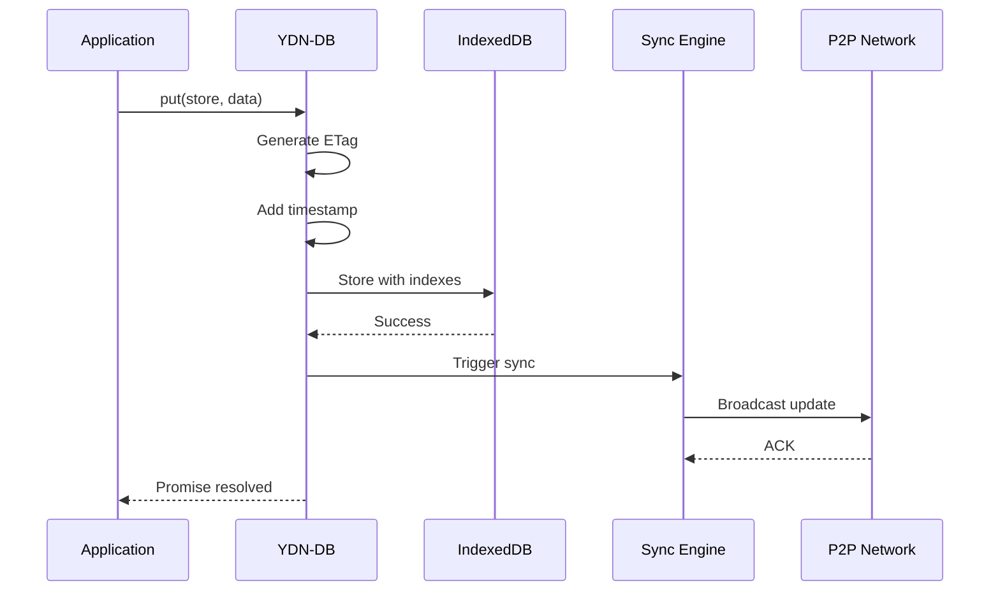

### Entity Synchronization in YDN-DB

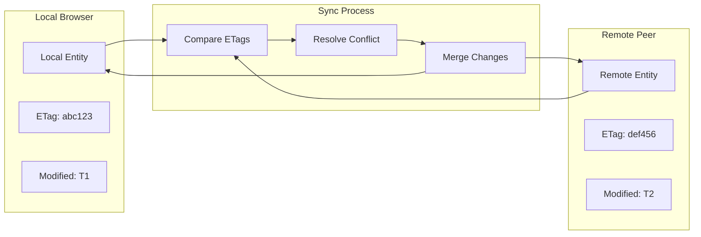

### YDN-DB Query Operations

```javascript
// Complex query example with YDN-DB
class YDNQueryEngine {
  constructor(db) {
    this.db = db;
  }

  async performComplexQuery() {
    // Query with multiple conditions
    const results = await this.db.values('cache')
      .where('nodeId').equals(1)
      .and('timestamp').between(startTime, endTime)
      .order('timestamp')
      .reverse()
      .limit(100)
      .toArray();

    return results;
  }

  async performJoin() {
    // Join-like operation across stores
    const cacheEntries = await this.db.values('cache').toArray();
    const syncLogs = await this.db.values('sync_log').toArray();

    // Manual join
    return cacheEntries.map(entry => ({
      ...entry,
      syncHistory: syncLogs.filter(log => log.key === entry.key)
    }));
  }

  async performAggregation() {
    // Aggregation operations
    const cursor = this.db.values('cache').open();
    let count = 0;
    let sum = 0;

    await cursor.forEach(entry => {
      count++;
      sum += entry.size || 0;
    });

    return { count, sum, average: sum / count };
  }
}
```

## CRDT Fundamentals and Types

### CRDT Types Overview

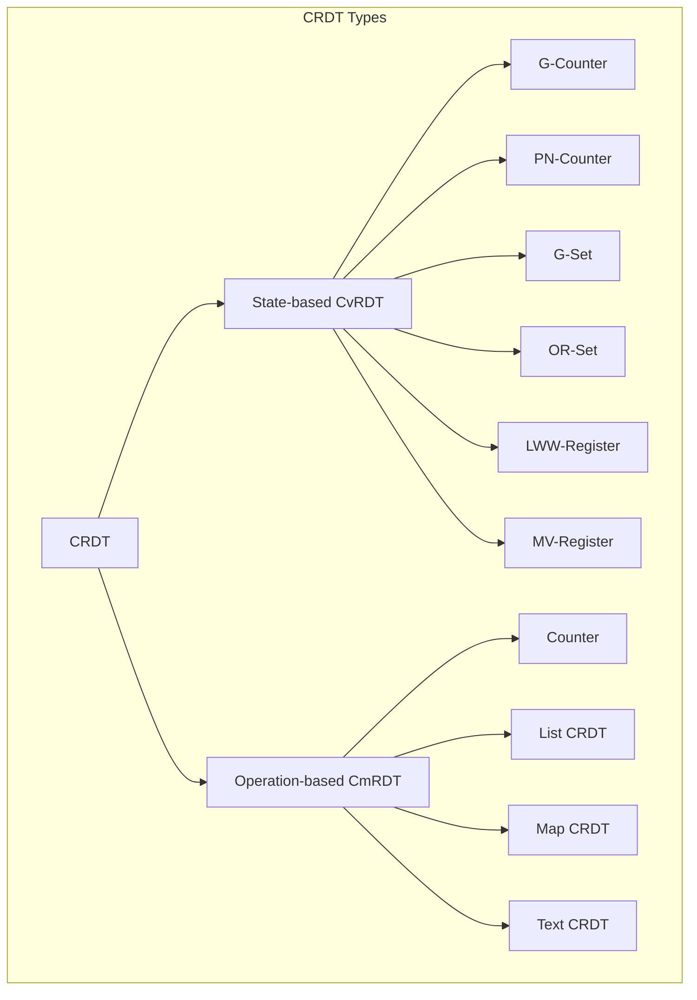

### G-Counter (Grow-only Counter) Implementation

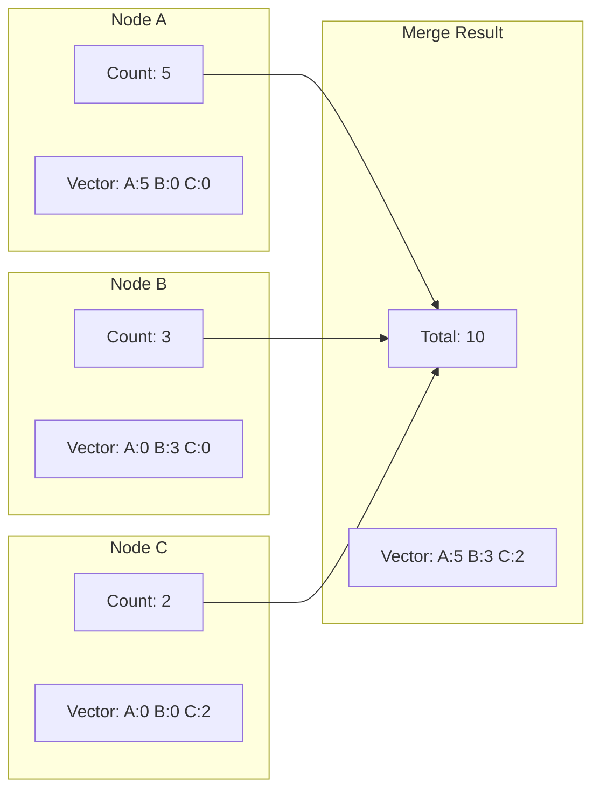

```javascript
class GCounter {
  constructor(nodeId) {
    this.nodeId = nodeId;
    this.counts = new Map(); // nodeId -> count
    this.counts.set(nodeId, 0);
  }

  increment(amount = 1) {
    const current = this.counts.get(this.nodeId) || 0;
    this.counts.set(this.nodeId, current + amount);
  }

  value() {
    let sum = 0;
    for (const count of this.counts.values()) {
      sum += count;
    }
    return sum;
  }

  merge(other) {
    for (const [nodeId, count] of other.counts) {
      const ourCount = this.counts.get(nodeId) || 0;
      this.counts.set(nodeId, Math.max(ourCount, count));
    }
  }

  toJSON() {
    return {
      nodeId: this.nodeId,
      counts: Array.from(this.counts.entries())
    };
  }
}
```

### OR-Set (Observed-Remove Set) Implementation

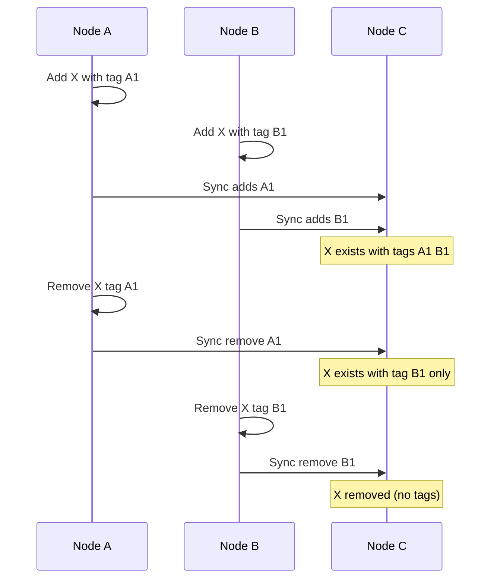

```javascript
class ORSet {
  constructor(nodeId) {
    this.nodeId = nodeId;
    this.elements = new Map(); // element -> Set of unique tags
    this.tombstones = new Set(); // removed tags
    this.clock = 0;
  }

  add(element) {
    const tag = `${this.nodeId}:${++this.clock}`;

    if (!this.elements.has(element)) {
      this.elements.set(element, new Set());
    }

    this.elements.get(element).add(tag);
    return tag;
  }

  remove(element) {
    if (this.elements.has(element)) {
      const tags = this.elements.get(element);
      for (const tag of tags) {
        this.tombstones.add(tag);
      }
      this.elements.delete(element);
    }
  }

  has(element) {
    if (!this.elements.has(element)) return false;

    const tags = this.elements.get(element);
    for (const tag of tags) {
      if (!this.tombstones.has(tag)) {
        return true;
      }
    }
    return false;
  }

  merge(other) {
    // Merge elements
    for (const [element, tags] of other.elements) {
      if (!this.elements.has(element)) {
        this.elements.set(element, new Set());
      }
      for (const tag of tags) {
        this.elements.get(element).add(tag);
      }
    }

    // Merge tombstones
    for (const tag of other.tombstones) {
      this.tombstones.add(tag);
    }

    // Clean up tombstoned elements
    for (const [element, tags] of this.elements) {
      const activeTags = new Set();
      for (const tag of tags) {
        if (!this.tombstones.has(tag)) {
          activeTags.add(tag);
        }
      }
      if (activeTags.size === 0) {
        this.elements.delete(element);
      } else {
        this.elements.set(element, activeTags);
      }
    }
  }
}
```

### LWW-Register (Last-Write-Wins Register)

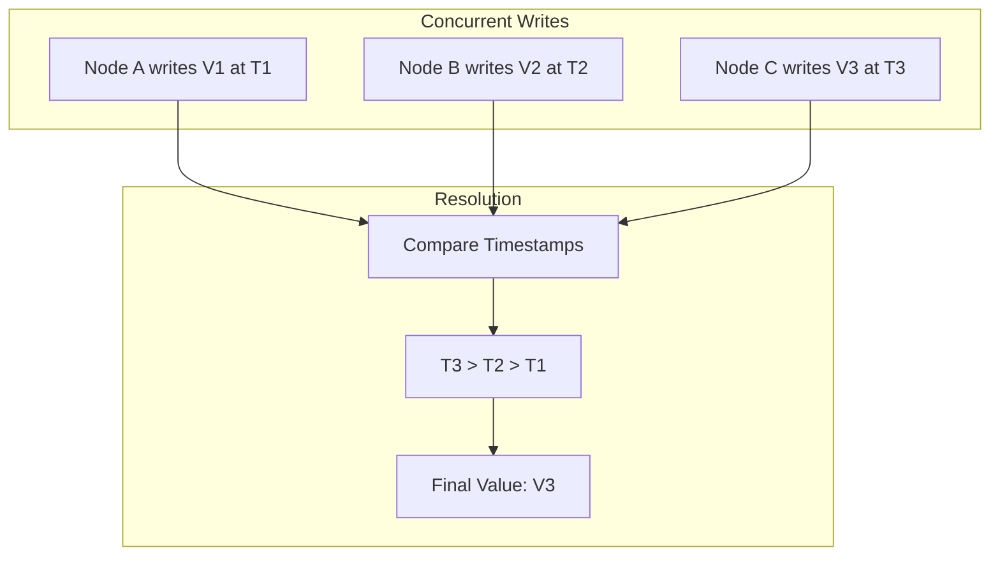

### RGA (Replicated Growable Array) for Text CRDT

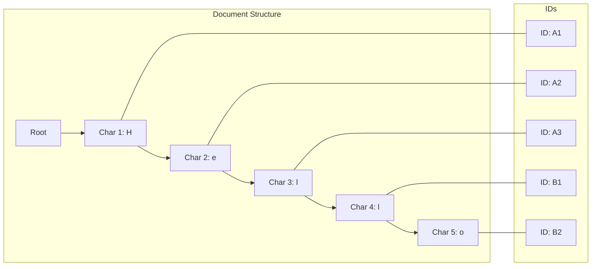

```javascript
class RGADocument {
  constructor(siteId) {
    this.siteId = siteId;
    this.clock = 0;
    this.content = []; // Array of characters with IDs
    this.tombstones = new Set();
  }

  insert(index, char) {
    const id = this.generateId();
    const leftId = index > 0 ? this.content[index - 1].id : null;
    const rightId = index < this.content.length ? this.content[index].id : null;

    const op = {
      type: 'insert',
      id: id,
      char: char,
      leftId: leftId,
      rightId: rightId
    };

    this.applyInsert(op);
    return op;
  }

  generateId() {
    return {
      site: this.siteId,
      clock: ++this.clock
    };
  }

  applyInsert(op) {
    let insertIndex = 0;

    // Find position based on left and right IDs
    for (let i = 0; i < this.content.length; i++) {
      if (this.idEquals(this.content[i].id, op.leftId)) {
        insertIndex = i + 1;
      }
      if (this.idEquals(this.content[i].id, op.rightId)) {
        break;
      }
    }

    // Insert at calculated position
    this.content.splice(insertIndex, 0, {
      id: op.id,
      char: op.char
    });
  }

  delete(index) {
    if (index < 0 || index >= this.content.length) return null;

    const id = this.content[index].id;
    this.tombstones.add(this.idToString(id));

    const op = {
      type: 'delete',
      id: id
    };

    return op;
  }

  applyDelete(op) {
    this.tombstones.add(this.idToString(op.id));
  }

  getText() {
    return this.content
      .filter(item => !this.tombstones.has(this.idToString(item.id)))
      .map(item => item.char)
      .join('');
  }

  merge(ops) {
    for (const op of ops) {
      if (op.type === 'insert') {
        this.applyInsert(op);
      } else if (op.type === 'delete') {
        this.applyDelete(op);
      }
    }
  }

  idEquals(id1, id2) {
    if (!id1 || !id2) return false;
    return id1.site === id2.site && id1.clock === id2.clock;
  }

  idToString(id) {
    return `${id.site}:${id.clock}`;
  }
}
```

## Integration Patterns

### YDN-DB with CRDT Integration

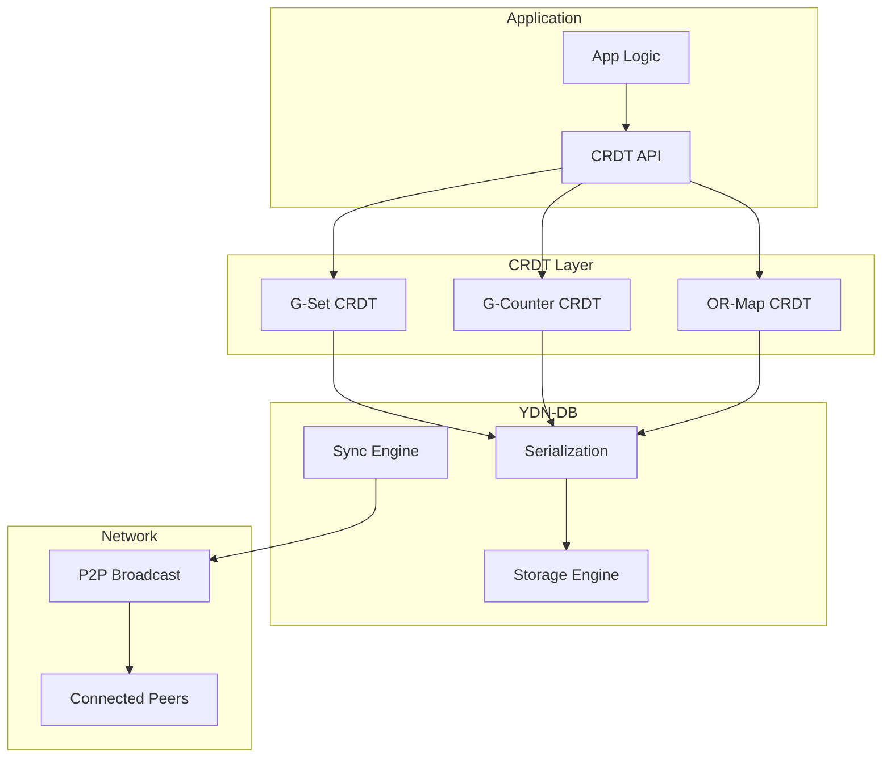

### Complete Integration Example

```javascript
class CRDTYDNIntegration {
  constructor(nodeId) {
    this.nodeId = nodeId;
    this.initializeDatabase();
    this.initializeCRDTs();
  }

  async initializeDatabase() {
    const schema = {
      stores: [{
        name: 'crdt_operations',
        keyPath: ['crdtId', 'opId'],
        indexes: [
          {name: 'by_timestamp', keyPath: 'timestamp'},
          {name: 'by_crdt', keyPath: 'crdtId'}
        ]
      }, {
        name: 'crdt_snapshots',
        keyPath: 'crdtId',
        indexes: [
          {name: 'by_version', keyPath: 'version'}
        ]
      }, {
        name: 'vector_clocks',
        keyPath: 'nodeId'
      }]
    };

    this.db = new ydn.db.Storage('crdt-ydn', schema);
  }

  initializeCRDTs() {
    this.crdts = {
      userCount: new GCounter(this.nodeId),
      activeUsers: new ORSet(this.nodeId),
      sharedDoc: new RGADocument(this.nodeId),
      config: new LWWRegister(this.nodeId)
    };
  }

  async saveCRDTOperation(crdtId, operation) {
    const op = {
      crdtId: crdtId,
      opId: `${this.nodeId}:${Date.now()}`,
      operation: operation,
      timestamp: Date.now(),
      nodeId: this.nodeId
    };

    await this.db.put('crdt_operations', op);
    return op;
  }

  async loadCRDTOperations(crdtId, since = 0) {
    const ops = await this.db.values('crdt_operations')
      .where('crdtId').equals(crdtId)
      .and('timestamp').above(since)
      .order('timestamp')
      .toArray();

    return ops;
  }

  async saveCRDTSnapshot(crdtId) {
    const crdt = this.crdts[crdtId];
    if (!crdt) throw new Error(`CRDT ${crdtId} not found`);

    const snapshot = {
      crdtId: crdtId,
      state: crdt.toJSON(),
      version: Date.now(),
      nodeId: this.nodeId
    };

    await this.db.put('crdt_snapshots', snapshot);
    return snapshot;
  }

  async loadCRDTSnapshot(crdtId) {
    const snapshot = await this.db.get('crdt_snapshots', crdtId);
    if (!snapshot) return null;

    const crdt = this.crdts[crdtId];
    crdt.fromJSON(snapshot.state);
    return snapshot;
  }

  async syncWithPeer(peerId, crdtId) {
    // Get our vector clock
    const ourClock = await this.db.get('vector_clocks', this.nodeId) || {
      nodeId: this.nodeId,
      clocks: {}
    };

    // Exchange vector clocks with peer
    const peerClock = await this.requestPeerClock(peerId);

    // Calculate delta
    const delta = await this.calculateDelta(crdtId, ourClock, peerClock);

    // Send our delta to peer
    await this.sendDelta(peerId, crdtId, delta.local);

    // Receive and apply peer's delta
    const peerDelta = await this.receiveDelta(peerId, crdtId);
    await this.applyDelta(crdtId, peerDelta);

    // Update vector clocks
    await this.updateVectorClock(peerClock);
  }

  async calculateDelta(crdtId, ourClock, peerClock) {
    const ourOps = await this.loadCRDTOperations(crdtId);
    const localDelta = [];
    const needed = [];

    for (const op of ourOps) {
      const opClock = this.getOpClock(op);

      if (!this.happenedBefore(opClock, peerClock)) {
        localDelta.push(op);
      }

      if (this.happenedBefore(peerClock, opClock)) {
        needed.push(op.opId);
      }
    }

    return {
      local: localDelta,
      needed: needed
    };
  }

  getOpClock(op) {
    return {
      nodeId: op.nodeId,
      timestamp: op.timestamp
    };
  }

  happenedBefore(clock1, clock2) {
    // Vector clock comparison
    return clock1.timestamp < clock2.clocks[clock1.nodeId];
  }

  async applyDelta(crdtId, delta) {
    const crdt = this.crdts[crdtId];

    for (const op of delta) {
      // Save operation
      await this.saveCRDTOperation(crdtId, op);

      // Apply to CRDT
      if (crdt.applyOperation) {
        crdt.applyOperation(op.operation);
      }
    }

    // Save snapshot periodically
    if (delta.length > 100) {
      await this.saveCRDTSnapshot(crdtId);
    }
  }
}
```

## Conflict Resolution Strategies

### Three-Way Merge Pattern

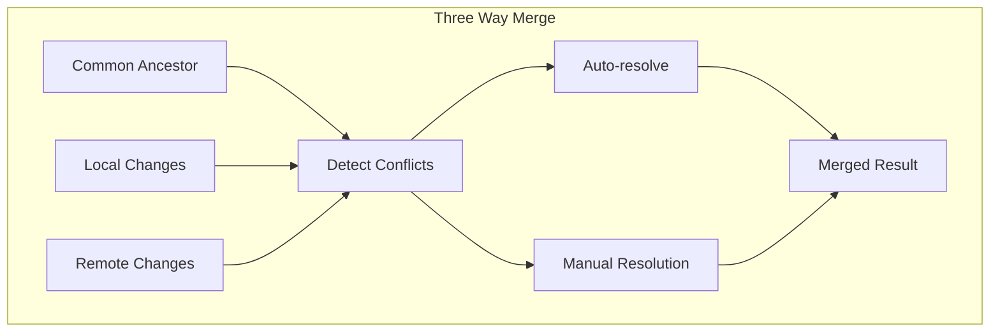

### Conflict Resolution Implementation

```javascript
class ConflictResolver {
  constructor() {
    this.strategies = new Map();
    this.registerDefaultStrategies();
  }

  registerDefaultStrategies() {
    // Last-Write-Wins
    this.strategies.set('lww', (local, remote) => {
      return local.timestamp > remote.timestamp ? local : remote;
    });

    // First-Write-Wins
    this.strategies.set('fww', (local, remote) => {
      return local.timestamp < remote.timestamp ? local : remote;
    });

    // Highest value wins
    this.strategies.set('max', (local, remote) => {
      return local.value > remote.value ? local : remote;
    });

    // Merge values
    this.strategies.set('merge', (local, remote) => {
      if (Array.isArray(local.value) && Array.isArray(remote.value)) {
        return {
          ...local,
          value: [...new Set([...local.value, ...remote.value])]
        };
      }
      return local;
    });

    // Custom function
    this.strategies.set('custom', (local, remote, customFn) => {
      return customFn(local, remote);
    });
  }

  async resolve(conflicts, strategy = 'lww', customFn = null) {
    const resolver = this.strategies.get(strategy);
    if (!resolver) {
      throw new Error(`Unknown strategy: ${strategy}`);
    }

    const resolved = [];

    for (const conflict of conflicts) {
      const result = resolver(
        conflict.local,
        conflict.remote,
        customFn
      );
      resolved.push(result);
    }

    return resolved;
  }

  async detectConflicts(local, remote) {
    const conflicts = [];
    const localMap = new Map(local.map(item => [item.key, item]));
    const remoteMap = new Map(remote.map(item => [item.key, item]));

    // Check each local item against remote
    for (const [key, localItem] of localMap) {
      const remoteItem = remoteMap.get(key);

      if (remoteItem && this.hasConflict(localItem, remoteItem)) {
        conflicts.push({
          key,
          local: localItem,
          remote: remoteItem,
          type: this.getConflictType(localItem, remoteItem)
        });
      }
    }

    return conflicts;
  }

  hasConflict(local, remote) {
    // Different values with different ETags
    return local.value !== remote.value &&
           local.etag !== remote.etag &&
           !this.isAncestor(local, remote) &&
           !this.isAncestor(remote, local);
  }

  isAncestor(item1, item2) {
    // Check if item1 is an ancestor of item2
    return item2.parentEtag === item1.etag;
  }

  getConflictType(local, remote) {
    if (local.deleted && remote.deleted) {
      return 'both-deleted';
    }
    if (local.deleted || remote.deleted) {
      return 'delete-update';
    }
    return 'concurrent-update';
  }
}
```

## Synchronization Protocols

### State Vector Exchange Protocol

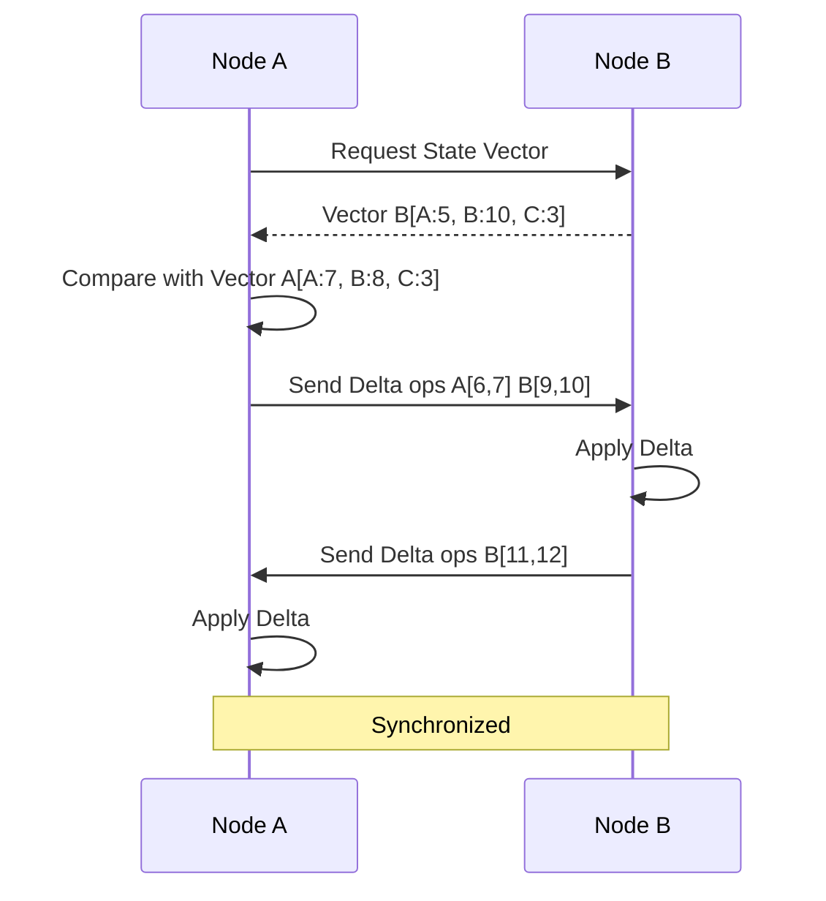

### Merkle Tree Synchronization

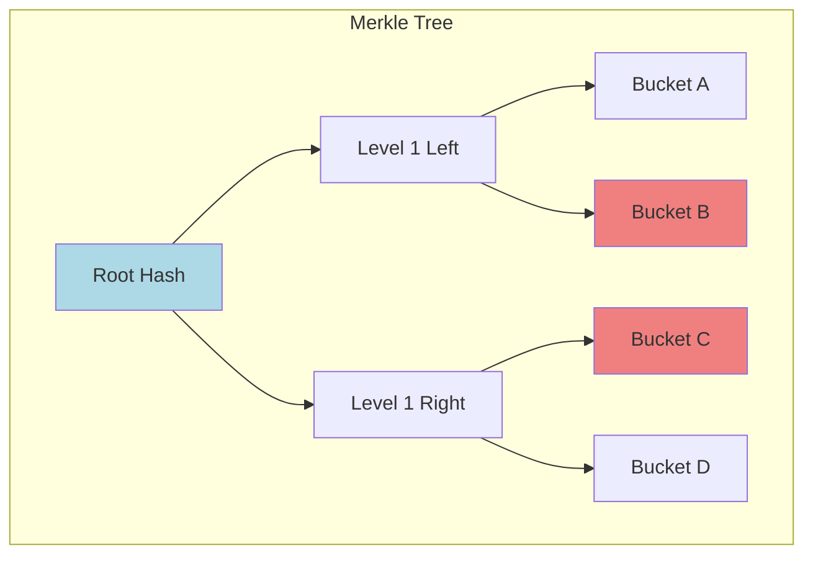

### Anti-Entropy Protocol Implementation

```javascript
class AntiEntropyProtocol {
  constructor(node) {
    this.node = node;
    this.syncInterval = 30000; // 30 seconds
    this.syncInProgress = new Set();
  }

  startAntiEntropy() {
    setInterval(() => {
      this.performAntiEntropy();
    }, this.syncInterval);
  }

  async performAntiEntropy() {
    const peers = this.node.getActivePeers();

    for (const peerId of peers) {
      if (!this.syncInProgress.has(peerId)) {
        this.syncWithPeer(peerId);
      }
    }
  }

  async syncWithPeer(peerId) {
    this.syncInProgress.add(peerId);

    try {
      // 1. Exchange Merkle tree roots
      const ourRoot = await this.computeMerkleRoot();
      const peerRoot = await this.requestMerkleRoot(peerId);

      if (ourRoot === peerRoot) {
        // Already synchronized
        return;
      }

      // 2. Find differing buckets
      const diffs = await this.findDifferences(peerId, ourRoot, peerRoot);

      // 3. Exchange only different data
      for (const bucket of diffs) {
        await this.syncBucket(peerId, bucket);
      }

      // 4. Verify synchronization
      await this.verifySyncComplete(peerId);

    } finally {
      this.syncInProgress.delete(peerId);
    }
  }

  async computeMerkleRoot() {
    const buckets = await this.getBuckets();
    const hashes = [];

    for (const bucket of buckets) {
      const hash = await this.hashBucket(bucket);
      hashes.push(hash);
    }

    return this.combineHashes(hashes);
  }

  async hashBucket(bucket) {
    const data = JSON.stringify(bucket.sort());
    const encoder = new TextEncoder();
    const dataBuffer = encoder.encode(data);
    const hashBuffer = await crypto.subtle.digest('SHA-256', dataBuffer);
    const hashArray = Array.from(new Uint8Array(hashBuffer));
    return hashArray.map(b => b.toString(16).padStart(2, '0')).join('');
  }

  async findDifferences(peerId, ourRoot, peerRoot) {
    const differences = [];
    const queue = [{level: 0, path: [], ourHash: ourRoot, peerHash: peerRoot}];

    while (queue.length > 0) {
      const {level, path, ourHash, peerHash} = queue.shift();

      if (ourHash === peerHash) {
        continue; // This subtree is synchronized
      }

      if (level >= this.maxLevel) {
        // Reached leaf level, this bucket differs
        differences.push(path);
        continue;
      }

      // Get children hashes
      const ourChildren = await this.getChildHashes(path);
      const peerChildren = await this.requestChildHashes(peerId, path);

      // Compare children
      for (let i = 0; i < ourChildren.length; i++) {
        if (ourChildren[i] !== peerChildren[i]) {
          queue.push({
            level: level + 1,
            path: [...path, i],
            ourHash: ourChildren[i],
            peerHash: peerChildren[i]
          });
        }
      }
    }

    return differences;
  }

  async syncBucket(peerId, bucketPath) {
    // Get our bucket data
    const ourData = await this.getBucketData(bucketPath);

    // Get peer's bucket data
    const peerData = await this.requestBucketData(peerId, bucketPath);

    // Find missing items in both directions
    const ourKeys = new Set(ourData.map(item => item.key));
    const peerKeys = new Set(peerData.map(item => item.key));

    const toSend = ourData.filter(item => !peerKeys.has(item.key));
    const toReceive = peerData.filter(item => !ourKeys.has(item.key));

    // Handle conflicts for common keys
    const conflicts = [];
    for (const ourItem of ourData) {
      const peerItem = peerData.find(p => p.key === ourItem.key);
      if (peerItem && ourItem.etag !== peerItem.etag) {
        conflicts.push({our: ourItem, peer: peerItem});
      }
    }

    // Resolve conflicts
    const resolved = await this.resolveConflicts(conflicts);

    // Apply changes
    await this.applyReceivedItems([...toReceive, ...resolved.toReceive]);
    await this.sendItems(peerId, [...toSend, ...resolved.toSend]);
  }

  async resolveConflicts(conflicts) {
    const toSend = [];
    const toReceive = [];

    for (const conflict of conflicts) {
      // Use Last-Write-Wins
      if (conflict.our.timestamp > conflict.peer.timestamp) {
        toSend.push(conflict.our);
      } else {
        toReceive.push(conflict.peer);
      }
    }

    return {toSend, toReceive};
  }
}
```

### Gossip Protocol for CRDT Propagation

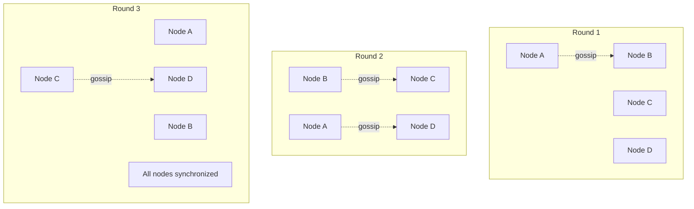

```javascript
class GossipProtocol {
  constructor(node) {
    this.node = node;
    this.fanout = 3; // Number of peers to gossip to
    this.interval = 5000; // 5 seconds
    this.seen = new Map(); // messageId -> timestamp
    this.maxAge = 60000; // 1 minute
  }

  startGossip() {
    setInterval(() => {
      this.gossipRound();
      this.cleanupSeen();
    }, this.interval);
  }

  async gossipRound() {
    // Select random peers
    const peers = this.selectGossipPeers();

    // Get recent updates
    const updates = await this.getRecentUpdates();

    if (updates.length === 0) return;

    // Create gossip message
    const message = {
      id: this.generateMessageId(),
      nodeId: this.node.nodeId,
      updates: updates,
      timestamp: Date.now()
    };

    // Mark as seen
    this.seen.set(message.id, message.timestamp);

    // Send to selected peers
    for (const peerId of peers) {
      this.sendGossip(peerId, message);
    }
  }

  selectGossipPeers() {
    const allPeers = this.node.getActivePeers();
    const selected = [];

    // Random selection
    while (selected.length < this.fanout && allPeers.length > 0) {
      const index = Math.floor(Math.random() * allPeers.length);
      selected.push(allPeers.splice(index, 1)[0]);
    }

    return selected;
  }

  async handleGossip(message) {
    // Check if we've seen this message
    if (this.seen.has(message.id)) {
      return;
    }

    // Mark as seen
    this.seen.set(message.id, message.timestamp);

    // Apply updates
    for (const update of message.updates) {
      await this.applyUpdate(update);
    }

    // Forward to other peers (epidemic spread)
    const peers = this.selectGossipPeers();
    for (const peerId of peers) {
      if (peerId !== message.nodeId) {
        this.sendGossip(peerId, message);
      }
    }
  }

  cleanupSeen() {
    const now = Date.now();
    for (const [id, timestamp] of this.seen) {
      if (now - timestamp > this.maxAge) {
        this.seen.delete(id);
      }
    }
  }

  generateMessageId() {
    return `${this.node.nodeId}-${Date.now()}-${Math.random()}`;
  }
}
```

## Implementation Examples

### Complete P2P CRDT Cache Implementation

```javascript
class P2PCRDTCache {
  constructor(nodeId) {
    this.nodeId = nodeId;
    this.initializeComponents();
  }

  async initializeComponents() {
    // Initialize YDN-DB
    this.db = new ydn.db.Storage('p2p-crdt-cache', {
      stores: [{
        name: 'cache',
        keyPath: 'key',
        indexes: [
          {name: 'by_timestamp', keyPath: 'timestamp'},
          {name: 'by_node', keyPath: 'nodeId'}
        ]
      }, {
        name: 'crdt_ops',
        keyPath: ['crdtType', 'opId'],
        indexes: [
          {name: 'by_timestamp', keyPath: 'timestamp'}
        ]
      }]
    });

    // Initialize CRDTs
    this.cache = new ORMap(this.nodeId);
    this.metadata = new GCounter(this.nodeId);

    // Initialize protocols
    this.gossip = new GossipProtocol(this);
    this.antiEntropy = new AntiEntropyProtocol(this);

    // Start protocols
    this.gossip.startGossip();
    this.antiEntropy.startAntiEntropy();
  }

  async set(key, value) {
    // Create CRDT operation
    const op = this.cache.set(key, value);

    // Store in YDN-DB
    await this.db.put('cache', {
      key: key,
      value: value,
      nodeId: this.nodeId,
      timestamp: Date.now(),
      etag: this.generateETag(value)
    });

    // Store CRDT operation
    await this.db.put('crdt_ops', {
      crdtType: 'cache',
      opId: op.id,
      operation: op,
      timestamp: Date.now()
    });

    // Increment metadata counter
    this.metadata.increment();

    // Gossip the update
    await this.gossip.gossipUpdate({
      type: 'cache_set',
      operation: op
    });

    return {success: true};
  }

  async get(key) {
    // Try local CRDT first
    const localValue = this.cache.get(key);
    if (localValue) return localValue;

    // Try YDN-DB
    const stored = await this.db.get('cache', key);
    if (stored) return stored.value;

    // Query peers if not found
    return await this.queryPeers(key);
  }

  async merge(peerState) {
    // Merge CRDT states
    this.cache.merge(peerState.cache);
    this.metadata.merge(peerState.metadata);

    // Store merged state in YDN-DB
    const cacheEntries = this.cache.toArray();
    for (const entry of cacheEntries) {
      await this.db.put('cache', {
        key: entry.key,
        value: entry.value,
        nodeId: entry.nodeId,
        timestamp: entry.timestamp,
        etag: entry.etag
      });
    }

    return {merged: true};
  }

  async queryPeers(key) {
    const peers = this.getActivePeers();
    const responses = [];

    for (const peerId of peers) {
      try {
        const response = await this.sendQuery(peerId, {
          type: 'get',
          key: key
        });
        if (response.value) {
          responses.push(response);
        }
      } catch (error) {
        console.error(`Failed to query peer ${peerId}:`, error);
      }
    }

    // Return most recent value (LWW)
    if (responses.length > 0) {
      responses.sort((a, b) => b.timestamp - a.timestamp);
      return responses[0].value;
    }

    return null;
  }

  generateETag(value) {
    const hash = crypto.createHash('sha256');
    hash.update(JSON.stringify(value));
    return hash.digest('hex');
  }
}
```

### Usage Example

```javascript
// Initialize nodes
const nodeA = new P2PCRDTCache('node-a');
const nodeB = new P2PCRDTCache('node-b');
const nodeC = new P2PCRDTCache('node-c');

// Set values on different nodes
await nodeA.set('user:1', {name: 'Alice', age: 30});
await nodeB.set('user:2', {name: 'Bob', age: 25});

// Concurrent updates (will be resolved by CRDT)
await nodeA.set('config', {theme: 'dark'});
await nodeB.set('config', {theme: 'light'});

// Merge will resolve to consistent state
await nodeA.merge(nodeB.getState());
await nodeB.merge(nodeA.getState());

// Both nodes now have same view
const configA = await nodeA.get('config');
const configB = await nodeB.get('config');
console.assert(configA === configB); // True

// Query across network
const user1 = await nodeC.get('user:1'); // Will query nodeA
console.log(user1); // {name: 'Alice', age: 30}
```

## Summary

This detailed specification shows how YDN-DB and CRDTs work together to create a robust distributed persistence layer for the Browser-as-Server architecture:

1. **YDN-DB** provides efficient local storage with IndexedDB, complex queries, and entity synchronization
2. **CRDTs** ensure automatic conflict resolution without coordination
3. **Integration patterns** show how to combine both technologies
4. **Synchronization protocols** enable efficient P2P data exchange
5. **Practical implementations** demonstrate real-world usage

The combination enables browsers to act as fully-featured distributed databases with:
- Automatic conflict resolution
- Offline-first capability
- P2P synchronization
- No central coordination required
- Cryptographic data integrity
- Efficient storage and queries